### 첫번째 푸쉬
- 프로젝트 생성( 사용한 Dependency )
  - Spring Boot DevTools
    - Spring 개발에 도움을 주는 도구들이 모여있는 곳이다.
  - Lombok
    - Getter, Setter, ToString, 생성자관련 어노테이션 까지 어노테이션등록 만으로 이를 해결해주는 아주 좋은 Depencency 이다
  - Spring Web
    - 해당 프레임워크로 웹 개발을 진행 할 수 있도록 도와주는 도구
    - HTTP 를 이용한 API 생성을 하도록 도와준다.
  - Spring JPA
    - Database ORM(Object Relational Mapper) 도구
    - Database 를 SQL을 통해 조작하지 않고, Object 를 생성 변경하여 조작을 할 수 있게 도와준다
    - 개발자의 입장에서는 객체를 조작하면서 데이터베이스까지 조작할 수 있는 것 처럼 보인다.
  - H2 Database
    - 데이터의 영구 저장이 아닌 메모리 저장으로 인한 휘발성 데이터 저장을 진행한다
    - 이는 상용화에 좋지 않고 주로 연습, 교육방면에서 사용된다

---
### 두번째 푸쉬
-  Controller 를 통해 DTO 의 값을 제대로 전달 받고 리턴(Response) 또한 정확히 나간다는 것을 Postman을 통해 확인

--- 
### 세번째 푸쉬
- Entity 에 JPA 를 활용하여 객체를 조정해서 진행하는 과정을 보여준다. 다양한 기능이 있다는 것을 보여준다.
- Entity 에 사용된 JPA 는 주석처리로 설명을 해놓았다.

---
### 네번째 푸쉬
- Entity 와 Controller 를 연결하고 원하는 Service 를 만들기
- 데이터 베이스와 가까운 Repository 생성
  1. 인터페이스를 통해 Repository 설정 ( 데이터를 어떻게 다룰까 하는 추상메소드 작성 )
  2. Repository 는 JPA 를 상속시켜 주는데 제네릭 값으로는 <다룰값, 다룰 객체의 id 값(Long)> 으로 지정한다.
  3. JPA 는 기본적으로 findById, findAll, save, delete 등 다양한 로직을 제공한다.
  4. Optional 은 null 값을 가질수 있는 Category 객체를 만들어 준다.
  5. 또한 Optional 은 isEmpty, elseOrThrow, isPresent 등 코드를 더욱 깔끔하게 작성할 수 있게 해준다.
- Service 생성 ( Repository 를 의존성 주입하여 생성)
  1. Service 는 클라이언트(소비자)에 가깝게 위치해 있는 클래스이다.
  2. 사용자가 느낄 수 있는 기본적인 기능을 준다. ( EX)createCategory )
  3. service 의 메소드 내용은 안에 적어놓았습니다.
- Controller 변경
  1. 맨처음 만들어 주었던 Controller 의 기능을 조금 바꿔주었다.
  2. 처음에는 그저 데이터가 잘 들어오는지만 확인하는 controller 에서 카테고리를 만들어주는 controller 로 변환
 
  - response 의 값이 이름만 나오는것이 아닌 id 값까지 가져오고 있는 모습을 볼수 있다.
  - 만약 같은 내용으로 요청을 한다면?
    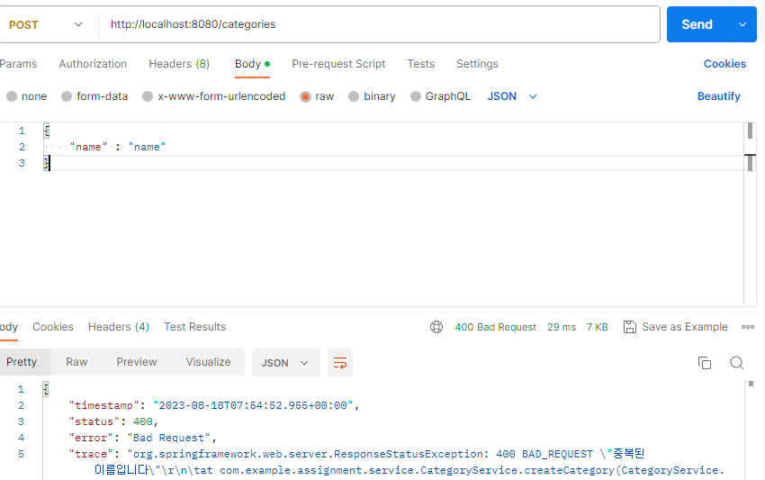
    - 이런 식으로 우리가 설정 해놓은 오류 "중복된 이름입니다" 라는 오류를 보내주고 
    - 오류 번호는 400으로써 클라이언트의 잘못된 요청이라는 사실을 알린다. 
    - 근데 여기서 중요한 문제가 생기는데 바로 Category Entity 에서 생성자가 없다면 이런 오류대신 서버 오류인 500대가 발생한다. 밑에서 따로 설명해보겠다.

---
### ⭐비상! 다섯번째 푸쉬⭐
이건 비상적으로 만든 푸쉬이다. 왜냐하면 기존의 코드를 보면 기본 생성자가 없이 제작을 했는데 그것때문에 같은 데이터를 전송할때 이런 오류가 발생한다. 
> "org.springframework.orm.jpa.JpaSystemException: No default constructor for entity : com.example.assignment.Entity"

오류의 내용 자체는 매우 간단하다. "기본 생성자 없음" 우선 해결 방법만 보자면 
1. 기본 생성자 코드를 작성한다
2. 기본 생성자 생성 어노테이션인 @NoArgsConstructor 를 사용한다.

이유
- JPA 가 엔티티를 관리하고 생성할때 기본 생성자를 사용하는데 이는 엔티티를 초기화하는 과정에도 사용되기도 한다. 근데 @Builder 를 통해 생성된 생성자로 인해 기본 생성자가 생성되지 않았다. 때문에 문제를 해결하기 위해 기본 생성자를 따로 직접 만들어 주어야 한다.
> 짧게 말해서 엔티티를 초기화하고 Entity 검증을 해야하는데 기본생성자가 없어서 불가능 했던것

---
### 여섯번째 푸쉬
- 이전까지 카테고리를 제작하는 과정을 보여주었다. 이젠 해당 카테고리를 가져오는 로직을 만들어보자
- Service 
  1. Service 에서 getCategoryById 로써 id 값을 기준으로 해당 카테고리를 가져온다.
  2. Optional 을 통해 orElseThrow 를 사용할 수 있었고 예외값으로는 예외처리로 카테고리가 존재하지 않는다는 메세지를 전달한다.
- Controller 
  1. 당연히 Controller 를 통해 들어오기 때문에 컨트롤러도 제작을 해주어야한다. 
  2. 값을 받는것은 URL 형태로 받을 것이며 데이터를 요청하는것 이기때문에 GET 을 사용했다.
  3. 때문에 값을 판단하는것은 PathVariable 으로 /{} 값을 확인한다

1. 제작하는 과정은 이미 위에서 다뤘으므로 생략하고 제작된 카테고리를 가져온다
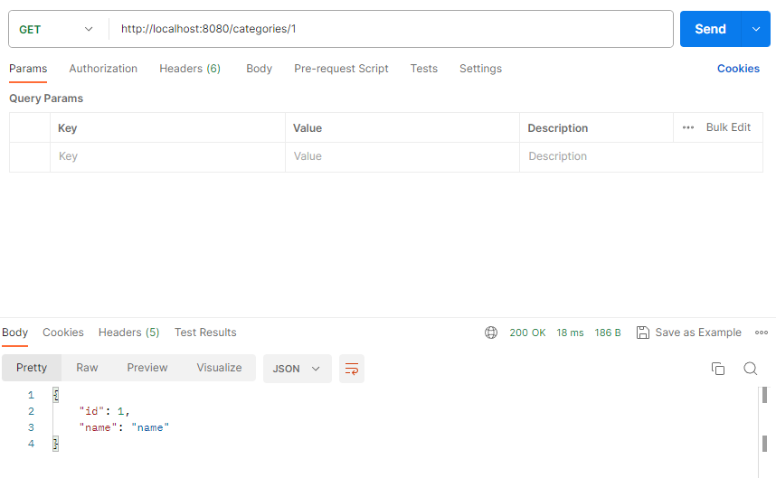

 

2. 존재하지 않는 id값으로 요청했을때 실패 ( 예상 결과 : 존재하지 않는 카테고리입니다. 라는 오류값 발생)   
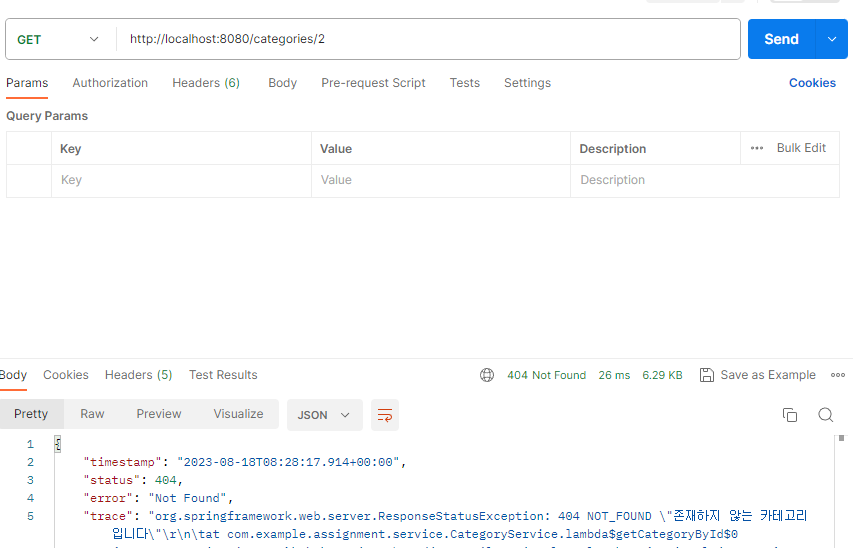

---
### 일곱번째 푸쉬
- 데이터를 한번에 한개가 아닌 여러개를 가져오려고 하는데 이때 모든 데이터가 아닌 페이징을 통해 정해진 만큼의 데이터만 가져온다.
- Page 를 사용해서 작성할 수 있는 기능이다.
- 인자로 Pageable을 받아서 URI 로 들어오는 param 형태를 목표와 사이즈를 결정해서 확인한다.
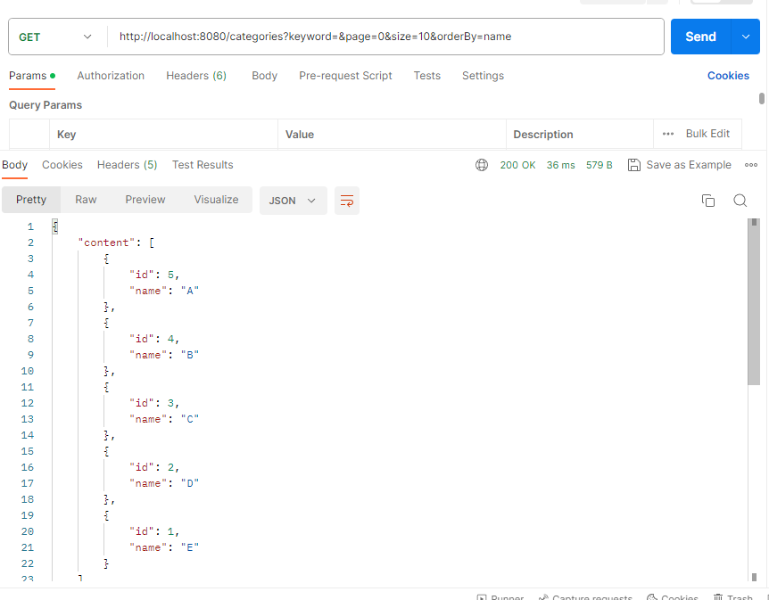
- 이렇게 굳이 검색 값을 주지 않고 모든 검색 결과를 나열한다 해당내용은 1페이지에 해당하는 값이다 페이지마다 10개씩 데이터를 가져오는데
- 만약 2페이지로 간다면 데이터가 없기 때문에 가져오지 않는것이다 
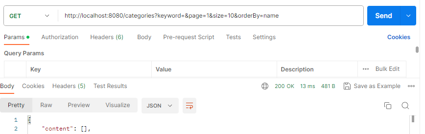
- 이렇게 값이 없을 것이다.
    
---
# 실제 과제

### 1. 메모 제작

---
- 만들어둔 Memo 내용을 사용한다 해당 내용은 카테고리 값을 찾고 거기에 메모 제목과 내용을 적어 넣는다.
- 데이터를 바디에 담아서 전송할 예정이기 때문에 POST 를 사용한다.
- 그리고 제목과 내용을 적어서 작성하면 해당 카테고리가 있는지 확인하고 혹시 존재하지 않는 카테고리를 원하는 경우 존재하지 않는 카테고리라고 전달
- 새로 작성한 내용
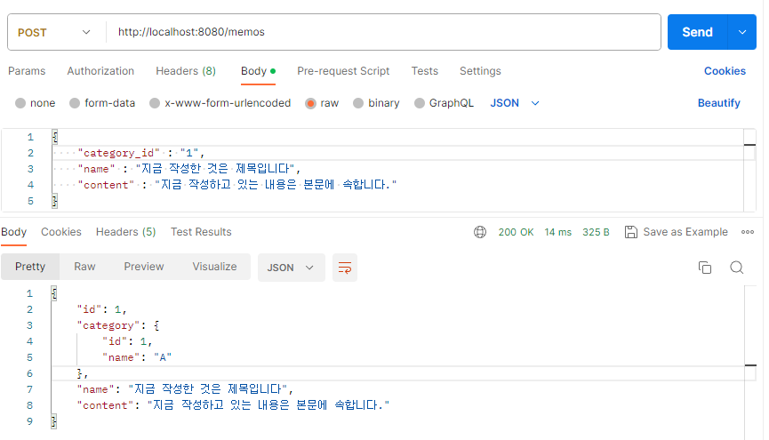

 

- 중복 제목으로 인한 오류 발생 
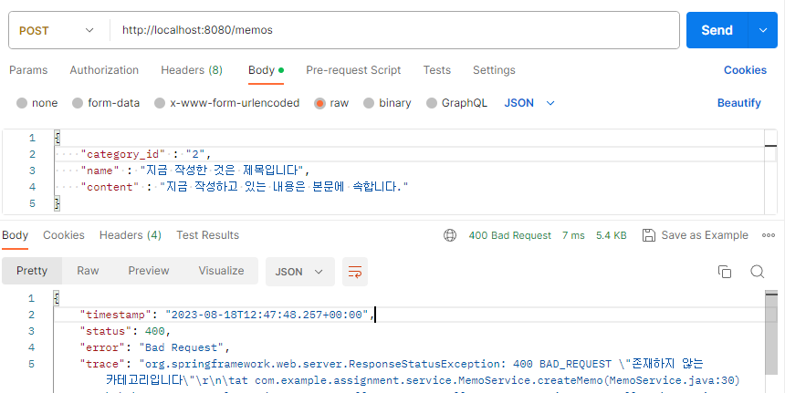

### 2. 메모 가져오기 ( 1개 )

---
- 작성한 메모를 가져오려고 하는데 이번에는 메모를 가져오기 때문에 메모의 id만 가져오면 된다.
- 이것은 Category 를 제공하는 과정에서 종료한다. 똑같이 GET 방식으로 데이터를 가져온다.
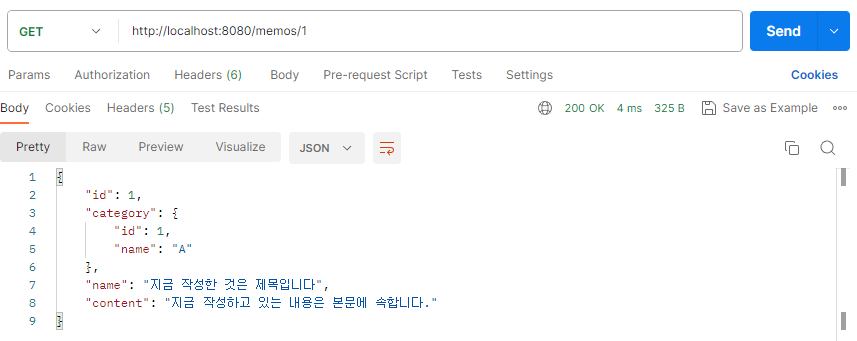
- 이렇게 작성했던 메모를 가져올수 있다.

### 3. 메모 수정하기

---
- 메모를 수정한다. 수정하는 HttpMethod 는 put 과 patch 가 있는데
- put 은 데이터(객체)를 모두 재조정하는것이고 patch 는 일부 데이터를 수정하는 역할을 한다.
- 나는 수정을 누르면 모든 내용이 적혀있고 바꾸고 싶은 내용을 바꾸고 전체적인 내용을 보내서 덧씌우는 느낌으로 가기위해서 PUT 을 사용한다.
- 그 과정에서 조금 변한게 있는데 고치는 과정에서 DTO 에서 MemoId 값을 가져와 줘야 한다는 것이고, 고쳐서 Builder 를 구성하는 과정에서 id 값이 변경되지 않아야 하기 때문에 추가해주었다
1. 메모 수정
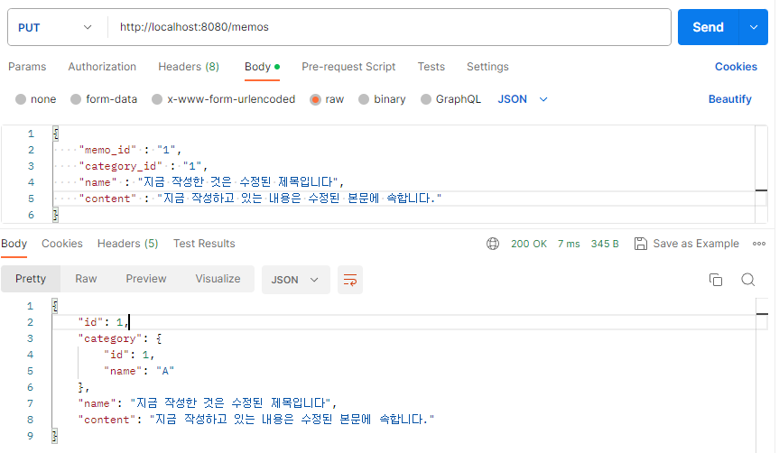

 

2. 수정된 메모 확인 ( 수정된 메모 내용 확인 )
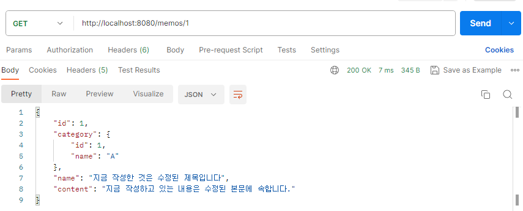

### 4. 메모 삭제하기

---
- 수정하는 것과 매우 비슷하지만 비교적으로 매우 쉽다. Memo 의 id 는 단 한개이고 중복값일수 없는 PK 이기때문에 id 로만 확인해서 삭제한다.
- 간단하다. 메모가 지워지는 행위는 똑같다. 예시로 id 가 1 이였던 메모를 지워보자
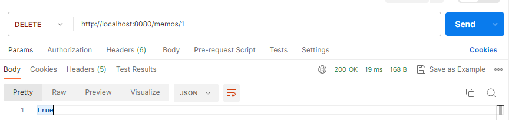

 

- 이런식으로 지우면 성공과 실패를 true or false 로 알려주고 다시 메모장을 확인해보면 기존의 메모가 사라진것을 알수 있다.
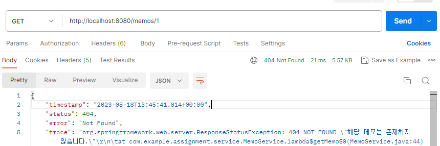

### 5. 메모 가져오기 ( 여러개 )

---
- 이제 여러개의 데이터를 전체적으로 가져오는 행위이다. 여러개의 메모는 한개의 카테고리 안에 있다. 즉 카테고리를 열면 그 안에 메모를 모두 가져와야한다.
- 이번엔 페이징 화 하지 않고 List 형태로 가져오게 될것이다. 초반에는 그저 스트림과 람다를 사용하지 않고 제작했다.
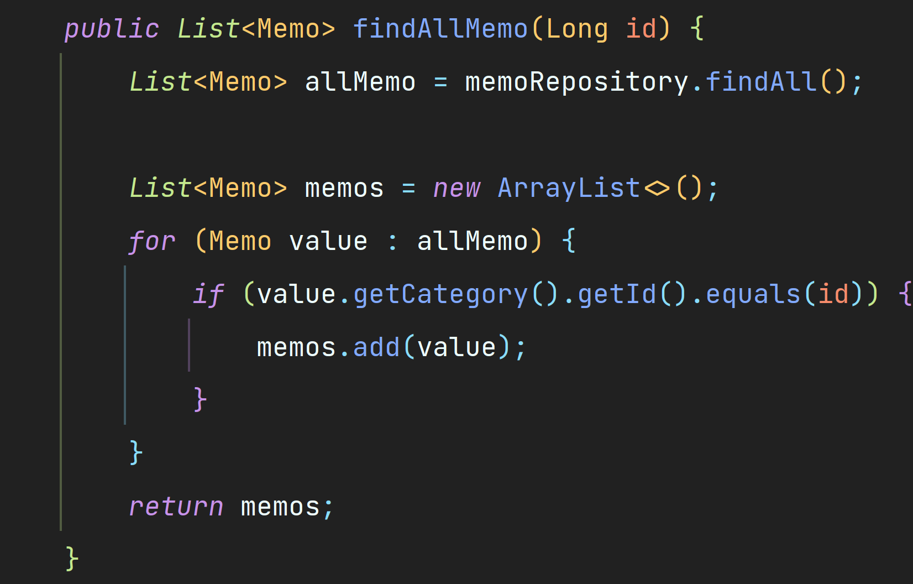

- 이는 람다와 스트림을 섞어서 사용할 수 있는데 현재 MemoRepository 에 있는 코드처럼 작성을 할 수 있는 것이다.
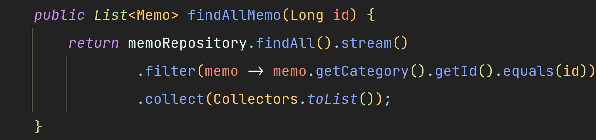

 

결과를 보여주기 전에 만들어져야 할 조건
1. 1번 카테고리에 2가지의 메모, 2번 카테고리에 2가지의 메모
2. 수정된 메모는 수정된 상태로 보여야 한다. ( 각 1번은 1번 메모를 수정, 2번은 2번 메모를 수정)
이 두가지를 조건으로 메모를 확인해보았다.

### 결과

1. A 카테고리( id = 1)에 속한 메모들
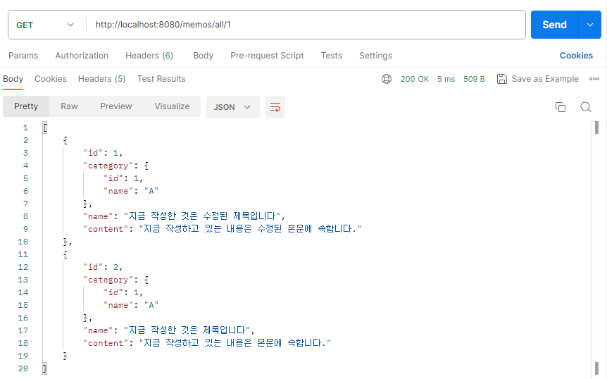
2. B 카테고리( id = 2)에 속한 메모들
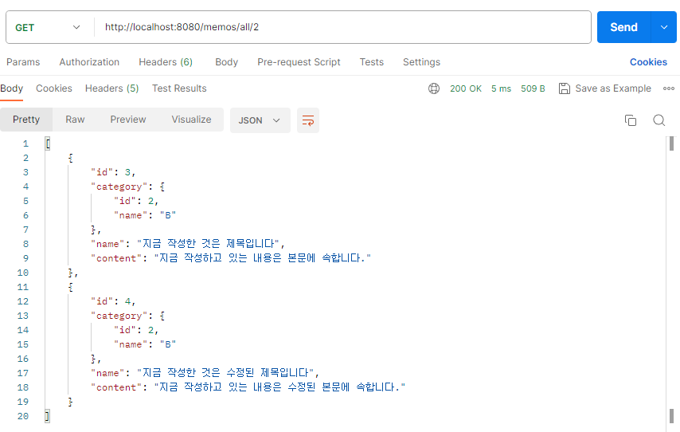
3. 마지막으로 마무리하는 만큼 B 카테고리의 메모 중 1번 메모를 지운다면 B 카테고리에서 id = 3인 메모는 사라지게 된다.
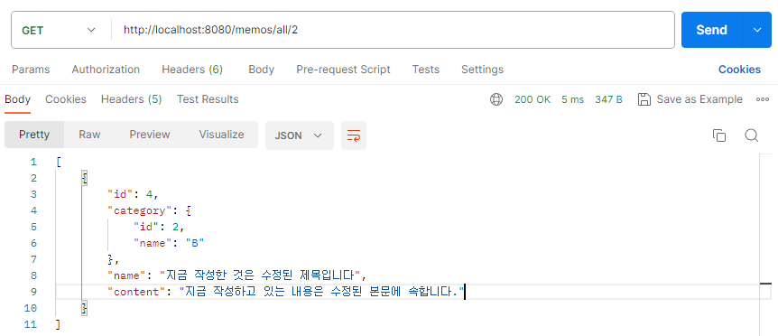